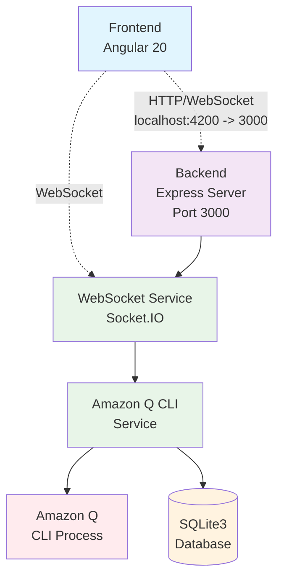
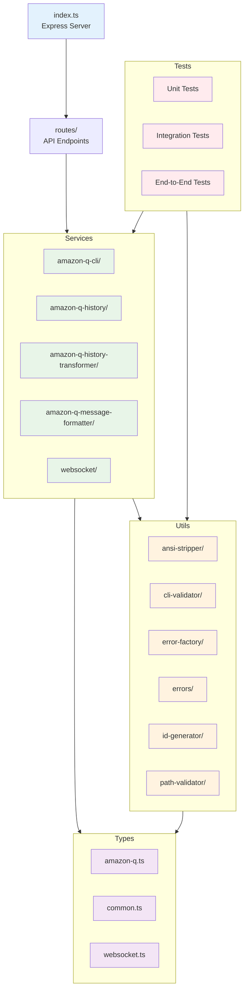
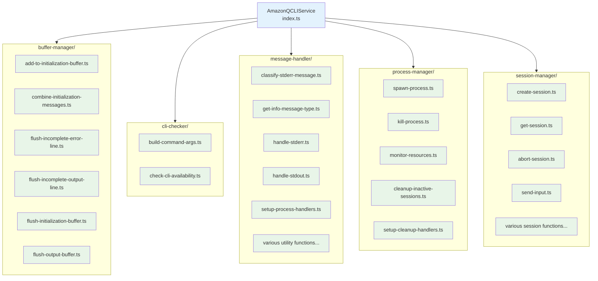
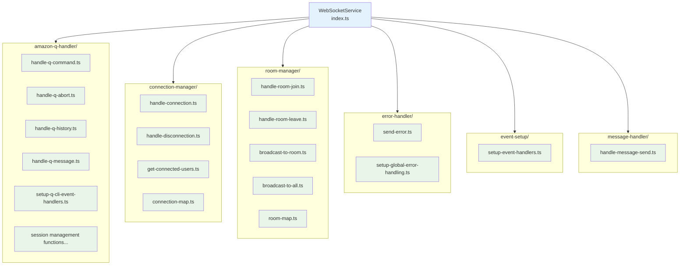
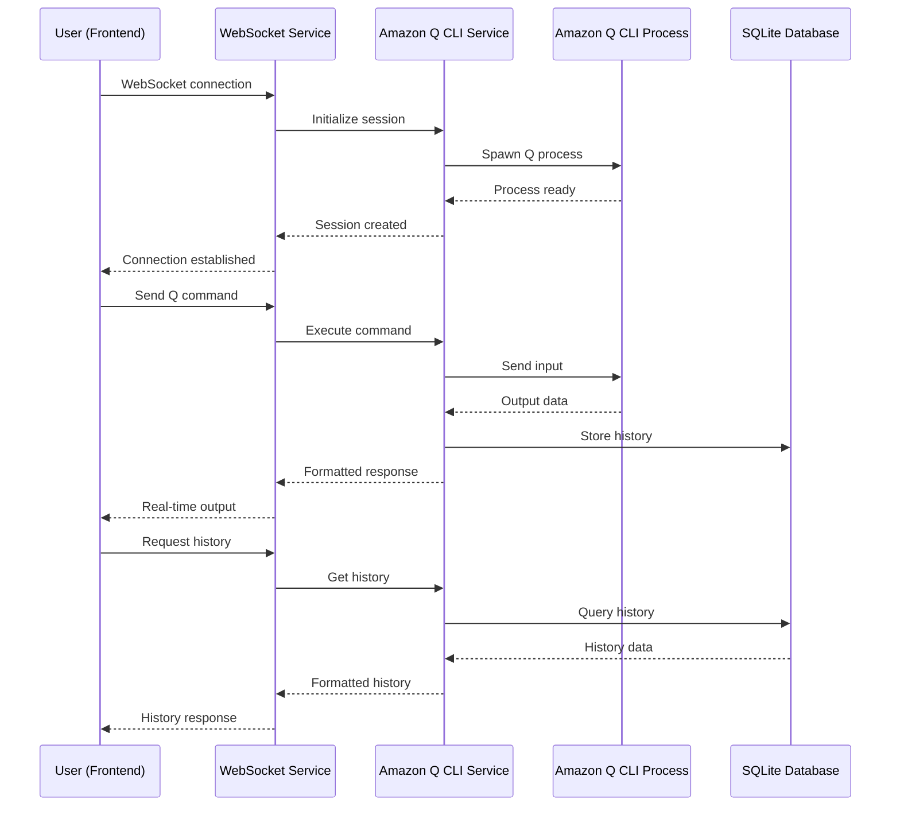
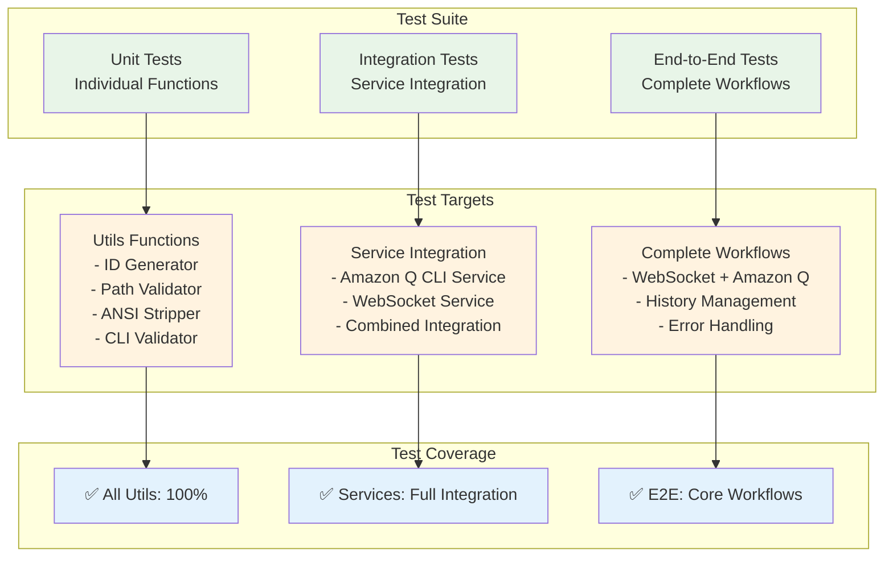

# バックエンドアーキテクチャ図

## 全体構成

## バックエンドサービス詳細構成

## Amazon Q CLI サービス詳細

## WebSocket サービス詳細

## データフロー図

## テストアーキテクチャ

## 1ファイル1関数アーキテクチャの利点

### モジュール性

- 各関数が独立したファイルに分離
- 関数の責任範囲が明確
- テストが容易

### 保守性

- 変更影響範囲が限定的
- デバッグが容易
- コードレビューが効率的

### 再利用性

- 関数の再利用が容易
- 他のプロジェクトへの移植性
- 依存関係の明確化

### テスト容易性

- 単体テストが書きやすい
- モックが作りやすい
- テストの独立性が保たれる
