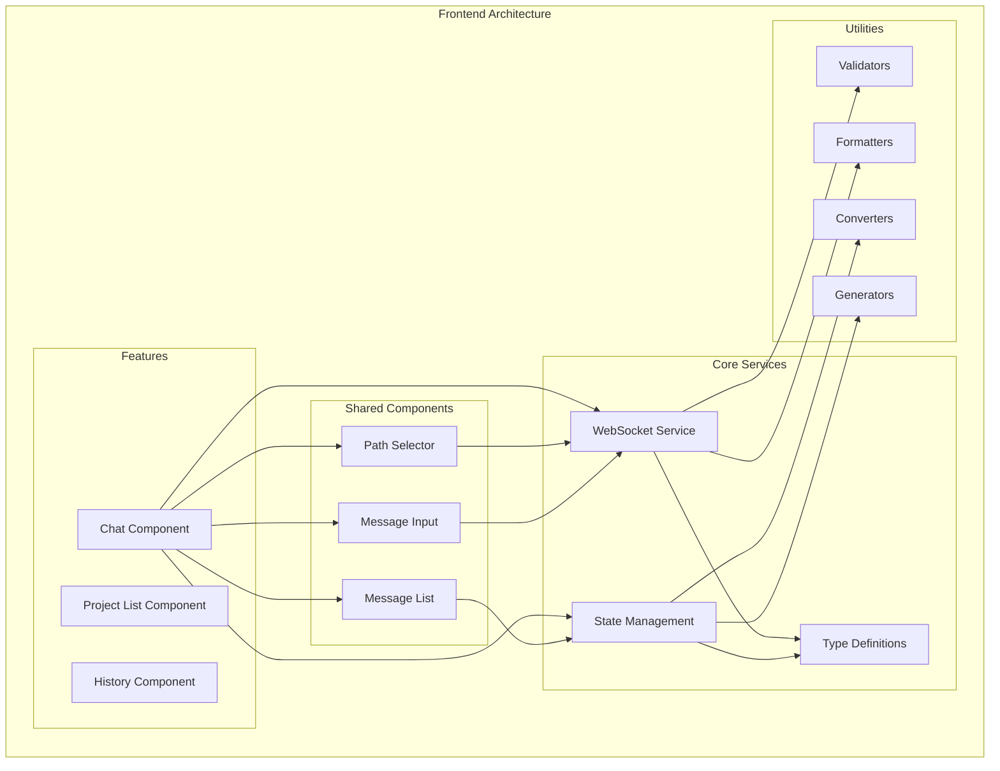
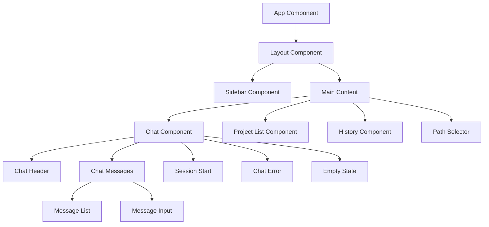
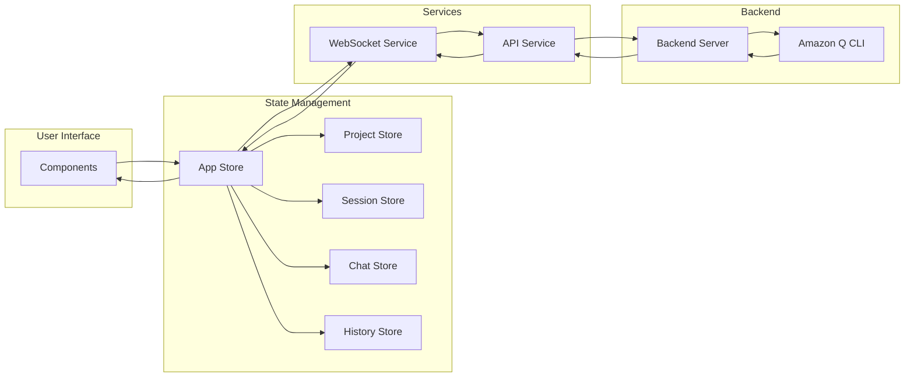
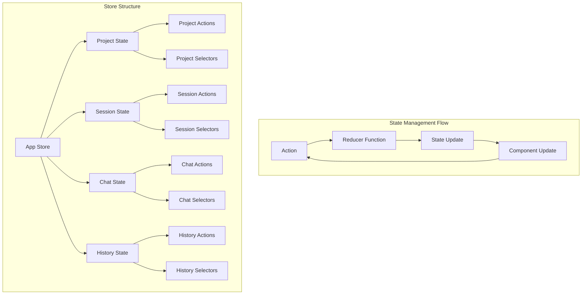

# フロントエンドアーキテクチャ

## 概要

このドキュメントは、フロントエンドアプリケーションのアーキテクチャについて説明します。アプリケーションは1ファイル1関数の原則に従って設計されており、モジュラーで保守性の高い構造となっています。

## アーキテクチャ図



## コンポーネント階層



## データフロー



## 状態管理フロー



## モジュール構造

### Core Modules

- **Services**: アプリケーションのコアロジック
- **Store**: 状態管理
- **Types**: 型定義

### Feature Modules

- **Chat**: チャット機能
- **Project**: プロジェクト管理
- **History**: 履歴表示

### Shared Modules

- **Components**: 再利用可能なコンポーネント
- **Utils**: ユーティリティ関数
- **Types**: 共有型定義

## 1ファイル1関数の原則

### 原則

1. **Single Responsibility**: 各ファイルは単一の責任を持つ
2. **Pure Functions**: 副作用のない純粋な関数
3. **Testability**: 独立してテスト可能
4. **Reusability**: 再利用しやすい設計

### 例

```typescript
// Bad: 複数の責任を持つファイル
export class UserService {
  validateUser(user: User): boolean { /* ... */ }
  formatUserName(user: User): string { /* ... */ }
  saveUser(user: User): void { /* ... */ }
}

// Good: 単一の責任を持つファイル
// validate-user.ts
export function validateUser(user: User): boolean { /* ... */ }

// format-user-name.ts
export function formatUserName(user: User): string { /* ... */ }

// save-user.ts
export function saveUser(user: User): void { /* ... */ }
```

## 型安全性

### 型定義の階層

1. **Common Types**: 基本的な型定義
2. **Domain Types**: ドメイン固有の型
3. **UI Types**: UI関連の型
4. **Service Types**: サービス固有の型

### 型ガード

```typescript
// 型ガード関数の例
export function isValidMessage(data: unknown): data is Message {
  return typeof data === 'object' && 
         data !== null && 
         'id' in data && 
         'content' in data;
}
```

## パフォーマンス最適化

### 戦略

1. **Lazy Loading**: 必要な時にのみコンポーネントをロード
2. **OnPush Strategy**: 変更検知戦略の最適化
3. **Signals**: Angularの新しいリアクティブプリミティブ
4. **Tree Shaking**: 不要なコードの除去

### 実装例

```typescript
@Component({
  selector: 'app-chat',
  changeDetection: ChangeDetectionStrategy.OnPush,
  // ...
})
export class ChatComponent {
  // Signals for reactive state
  messages = signal<Message[]>([]);
  
  // Computed values
  messageCount = computed(() => this.messages().length);
}
```

## テスト戦略

### テストの種類

1. **Unit Tests**: 個別の関数・コンポーネントのテスト
2. **Integration Tests**: モジュール間の連携テスト
3. **E2E Tests**: エンドツーエンドのテスト

### テスト構造

```
src/
├── app/
│   ├── core/
│   │   ├── services/
│   │   │   ├── websocket.service.ts
│   │   │   └── websocket.service.spec.ts
│   │   └── store/
│   │       ├── app.state.ts
│   │       └── app.state.spec.ts
│   └── shared/
│       ├── utils/
│       │   ├── validators/
│       │   │   ├── path-validator.ts
│       │   │   └── path-validator.spec.ts
│       │   └── formatters/
│       │       ├── date-formatter.ts
│       │       └── date-formatter.spec.ts
```

## 開発ガイドライン

### コーディング規約

1. **TypeScript Strict Mode**: 厳密な型チェック
2. **ESLint**: コード品質の確保
3. **Prettier**: コードフォーマット
4. **Conventional Commits**: コミットメッセージの統一

### コードレビュー

1. **Type Safety**: 型安全性の確認
2. **Test Coverage**: テストカバレッジの確認
3. **Performance**: パフォーマンスの確認
4. **Architecture**: アーキテクチャの一貫性確認

## デプロイメント

### ビルド戦略

1. **Production Build**: 本番環境用の最適化ビルド
2. **Bundle Analysis**: バンドルサイズの分析
3. **Tree Shaking**: 不要コードの除去
4. **Minification**: コードの最小化

### 環境設定

```typescript
// environment.ts
export const environment = {
  production: false,
  apiUrl: 'http://localhost:3000',
  websocketUrl: 'ws://localhost:3000'
};
```

## まとめ

このアーキテクチャにより、以下の利点が得られます：

1. **保守性**: 1ファイル1関数により、コードの理解と修正が容易
2. **拡張性**: モジュラー設計により、新機能の追加が簡単
3. **テスト性**: 独立した関数により、テストが容易
4. **再利用性**: 純粋な関数により、再利用が可能
5. **型安全性**: TypeScriptの型システムによる安全性

このアーキテクチャは、現代的なフロントエンド開発のベストプラクティスに基づいており、スケーラブルで保守性の高いアプリケーションを構築できます。