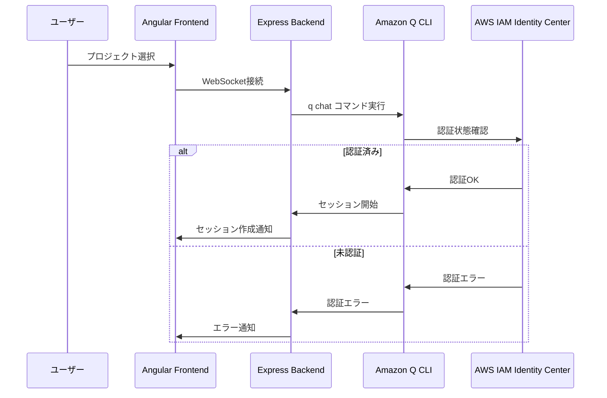

# セキュリティアーキテクチャ

## 概要

Quincyのセキュリティアーキテクチャは、Amazon Q CLIへの認証委譲を基盤とし、プロセス分離とアクセス制御により安全性を確保しています。Web アプリケーションとしてのセキュリティ対策と、Amazon Q CLI統合に特化したセキュリティ設計を組み合わせています。

## セキュリティ原則

### 1. 認証委譲の原則

- Quincy自身は認証情報を保持しない
- Amazon Q CLIの認証メカニズムを活用
- AWS IAM Identity Center との統合

### 2. プロセス分離の原則

- 各セッションは独立したプロセス
- プロセス間での情報漏洩を防止
- 適切なリソース制限

### 3. 最小権限の原則

- 必要最小限のファイルアクセス権限
- プロジェクトディレクトリ内での操作制限
- 適切な入力検証

## 認証・認可アーキテクチャ

### 1. 認証フロー



### 2. 認証状態管理

- **認証情報の非保持**: Quincy は認証情報を保存しない
- **セッションベース認証**: Amazon Q CLI の認証状態に依存
- **自動認証更新**: AWS IAM Identity Center による自動更新

### 3. 認可メカニズム

- **プロジェクトベース認可**: プロジェクトディレクトリ内でのみ動作
- **ユーザーコンテキスト**: 実行ユーザーのファイル権限を継承
- **コマンド制限**: 許可されたコマンドのみ実行

## プロセス分離とサンドボックス

### 1. プロセス分離設計

```
┌─────────────────────────────────────────────────┐
│                Main Process                      │
│  ┌─────────────────┐  ┌─────────────────┐        │
│  │   Express.js    │  │   Socket.io     │        │
│  │   Server        │  │   Server        │        │
│  └─────────────────┘  └─────────────────┘        │
│                                                  │
│  ┌─────────────────────────────────────────────┐ │
│  │            Process Manager                  │ │
│  └─────────────────────────────────────────────┘ │
└─────────────────────────────────────────────────┘
                        │
                        ▼
┌─────────────────────────────────────────────────┐
│                Child Processes                   │
│  ┌─────────────────┐  ┌─────────────────┐        │
│  │   Q CLI Proc    │  │   Q CLI Proc    │        │
│  │   Session 1     │  │   Session 2     │        │
│  │   /project/1    │  │   /project/2    │        │
│  └─────────────────┘  └─────────────────┘        │
└─────────────────────────────────────────────────┘
```

### 2. プロセス管理セキュリティ

#### プロセス起動時の検証

- **コマンド検証**: 許可されたコマンドのみ実行
- **パス検証**: 絶対パスの強制、相対パス禁止
- **権限検証**: 適切なファイル権限の確認

#### 実行時制限

- **Working Directory**: 指定されたプロジェクトディレクトリに制限
- **環境変数**: 必要最小限の環境変数のみ継承
- **リソース制限**: メモリ・CPU使用量の監視

#### プロセス終了時のクリーンアップ

- **リソース解放**: 適切なリソース解放処理
- **セッション削除**: セッション情報の完全削除
- **ファイル削除**: 一時ファイルの削除

### 3. サンドボックス機能

#### ファイルアクセス制御

```typescript
// プロジェクトパス検証の例
async validateProjectPath(projectPath: string): Promise<{
  valid: boolean;
  error?: string;
  normalizedPath?: string;
}> {
  // 絶対パスチェック
  if (!isAbsolute(trimmedPath)) {
    return { valid: false, error: 'Project path must be an absolute path' };
  }

  // 正規化とセキュリティチェック
  const normalizedPath = normalize(resolve(trimmedPath));

  // 危険なパス（システムディレクトリ等）の除外
  // 実装は apps/backend/src/services/amazon-q-cli.ts を参照
}
```

#### プロセス実行制限

- **コマンド制限**: `q` コマンドのみ許可
- **引数検証**: 危険な引数の除外
- **シェルエスケープ**: 適切なエスケープ処理

## ネットワークセキュリティ

### 1. CORS設定

```typescript
// 開発環境
const corsOptions = {
  origin: ['http://localhost:4200', 'http://localhost:3000'],
  methods: ['GET', 'POST', 'PUT', 'DELETE', 'OPTIONS'],
  allowedHeaders: ['Content-Type', 'Authorization'],
  credentials: true,
};

// 本番環境
const corsOptions = {
  origin: [process.env.FRONTEND_URL],
  methods: ['GET', 'POST', 'PUT', 'DELETE', 'OPTIONS'],
  allowedHeaders: ['Content-Type', 'Authorization'],
  credentials: true,
};
```

### 2. Content Security Policy (CSP)

```typescript
app.use(
  helmet({
    contentSecurityPolicy: {
      directives: {
        defaultSrc: ["'self'"],
        styleSrc: ["'self'", "'unsafe-inline'"],
        scriptSrc: ["'self'"],
        connectSrc: ["'self'", 'ws:', 'wss:'],
      },
    },
    crossOriginEmbedderPolicy: false, // Socket.io compatibility
  })
);
```

### 3. WebSocket セキュリティ

#### 接続検証

```typescript
// 接続時の検証
this.io.use((socket, next) => {
  try {
    // 基本的な接続検証
    console.log(`Connection attempt from: ${socket.handshake.address}`);

    // 必要に応じて追加の検証ロジック
    // IP制限、レート制限等

    next();
  } catch (error) {
    next(new Error('Connection validation failed'));
  }
});
```

#### 通信暗号化

- **TLS/SSL**: HTTPS/WSS の強制（本番環境）
- **Socket.io 暗号化**: 自動的な通信暗号化
- **データ検証**: 受信データの検証

## 入力検証とサニタイゼーション

### 1. パス検証

```typescript
// 危険なパスパターンの検出
const dangerousPatterns = [
  /\.\./, // ディレクトリトラバーサル
  /~\//, // ホームディレクトリ
  /\/etc\//, // システム設定ディレクトリ
  /\/tmp\//, // 一時ディレクトリ
  /\/var\//, // システム変数ディレクトリ
  /\/usr\/bin\//, // システムバイナリ
  /\/bin\//, // システムバイナリ
  /\/root\//, // root ディレクトリ
  /\/proc\//, // プロセス情報
  /\/sys\//, // システム情報
];

// パスの安全性検証
const isSafePath = !dangerousPatterns.some(pattern => pattern.test(normalizedPath));
```

### 2. コマンド検証

```typescript
// 許可されたコマンドのみ実行
const allowedCommands = ['chat', 'help', 'version'];

if (!allowedCommands.includes(command)) {
  throw new Error(`Command '${command}' is not allowed`);
}
```

### 3. 入力サニタイゼーション

#### WebSocket メッセージ

- **最大長制限**: メッセージ長の制限（10MB）
- **文字コード検証**: 有効な UTF-8 文字のみ許可
- **制御文字除去**: 危険な制御文字の除去

#### ファイルパス

- **正規化**: パスの正規化処理
- **相対パス禁止**: 絶対パスの強制
- **特殊文字除去**: 危険な特殊文字の除去

## データ保護

### 1. セッションデータ

#### 保存データの最小化

- **一時保存**: 必要最小限のデータのみ保存
- **自動削除**: セッション終了時の自動削除
- **暗号化**: 機密データの暗号化

#### SQLite データベース

- **ファイル権限**: 適切なファイル権限設定
- **アクセス制御**: 読み取り専用アクセス
- **バックアップ保護**: バックアップファイルの保護

### 2. ログ管理

#### ログフィルタリング

- **機密情報除去**: 認証情報等の除去
- **個人情報保護**: 個人識別情報の除去
- **適切なログレベル**: 機密度に応じたログレベル

#### ログ保存

- **ファイル権限**: 適切なファイル権限設定
- **ローテーション**: 定期的なログローテーション
- **長期保存**: 必要最小限の保存期間

## 監査とモニタリング

### 1. セキュリティイベントログ

```typescript
// セキュリティイベントの記録
const securityLogger = {
  logAuthenticationAttempt: (result: 'success' | 'failure', details: any) => {
    logger.info(`Authentication ${result}`, {
      timestamp: new Date().toISOString(),
      event: 'auth_attempt',
      result,
      details,
    });
  },

  logProcessStart: (sessionId: string, projectPath: string) => {
    logger.info('Process started', {
      timestamp: new Date().toISOString(),
      event: 'process_start',
      sessionId,
      projectPath,
    });
  },

  logSecurityViolation: (type: string, details: any) => {
    logger.error('Security violation', {
      timestamp: new Date().toISOString(),
      event: 'security_violation',
      type,
      details,
    });
  },
};
```

### 2. 異常検知

#### プロセス監視

- **異常終了検知**: プロセス異常終了の検知
- **リソース監視**: メモリ・CPU使用量の監視
- **タイムアウト監視**: 応答時間の監視

#### 接続監視

- **異常接続検知**: 不正な接続の検知
- **レート制限**: 過度な接続要求の制限
- **ブルートフォース対策**: 連続失敗の検知

### 3. インシデント対応

#### 自動対応

- **プロセス自動終了**: 異常検知時の自動終了
- **接続自動切断**: 不正接続の自動切断
- **アラート送信**: 管理者への自動通知

#### 手動対応

- **セッション強制終了**: 管理者による強制終了
- **ログ分析**: 詳細なログ分析
- **再発防止**: セキュリティ設定の更新

## 脆弱性対策

### 1. 既知の脆弱性

#### Command Injection

- **入力検証**: 厳格な入力検証
- **シェルエスケープ**: 適切なエスケープ処理
- **コマンド制限**: 許可されたコマンドのみ

#### Path Traversal

- **パス正規化**: 適切なパス正規化
- **範囲制限**: アクセス可能範囲の制限
- **相対パス禁止**: 絶対パスの強制

#### XSS/CSRF

- **CSP設定**: Content Security Policy
- **入力サニタイゼーション**: 適切な入力処理
- **CORS設定**: 適切なCORS設定

### 2. 依存関係管理

#### パッケージセキュリティ

- **脆弱性スキャン**: 定期的な脆弱性スキャン
- **アップデート管理**: 適切なアップデート管理
- **最小依存**: 不要な依存関係の除去

#### バージョン管理

- **固定バージョン**: 明確なバージョン固定
- **セキュリティパッチ**: 緊急セキュリティパッチ適用
- **テスト**: アップデート後のテスト

### 3. 運用セキュリティ

#### デプロイメント

- **セキュア設定**: 本番環境のセキュア設定
- **環境変数**: 機密情報の環境変数管理
- **権限管理**: 適切なファイル・プロセス権限

#### 監視・保守

- **セキュリティ監視**: 継続的なセキュリティ監視
- **定期監査**: 定期的なセキュリティ監査
- **インシデント対応**: 迅速なインシデント対応

## 設定とベストプラクティス

### 1. 開発環境設定

```typescript
// 開発環境のセキュリティ設定
const developmentConfig = {
  cors: {
    origin: ['http://localhost:4200', 'http://localhost:3000'],
    credentials: true,
  },
  logging: {
    level: 'debug',
    includeStackTrace: true,
  },
  validation: {
    strictMode: true,
    validatePaths: true,
  },
};
```

### 2. 本番環境設定

```typescript
// 本番環境のセキュリティ設定
const productionConfig = {
  cors: {
    origin: [process.env.FRONTEND_URL],
    credentials: true,
  },
  logging: {
    level: 'info',
    includeStackTrace: false,
  },
  validation: {
    strictMode: true,
    validatePaths: true,
  },
  security: {
    enableCSP: true,
    enableHSTS: true,
    enableXSSProtection: true,
  },
};
```

### 3. セキュリティチェックリスト

#### 開発時

- [ ] 入力検証の実装
- [ ] 適切なエラーハンドリング
- [ ] セキュリティテストの実施
- [ ] 依存関係の脆弱性チェック

#### デプロイ時

- [ ] 本番環境設定の確認
- [ ] 環境変数の設定
- [ ] ファイル権限の設定
- [ ] SSL/TLS の設定

#### 運用時

- [ ] セキュリティ監視の実装
- [ ] ログ監視の実装
- [ ] 定期的な脆弱性スキャン
- [ ] インシデント対応計画の策定
