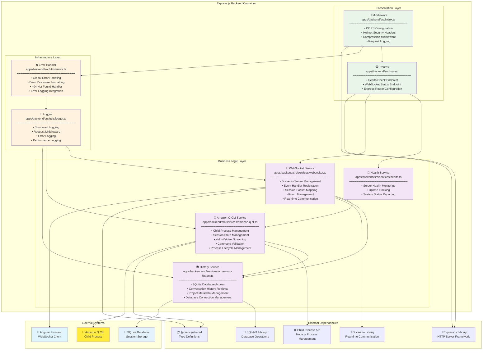
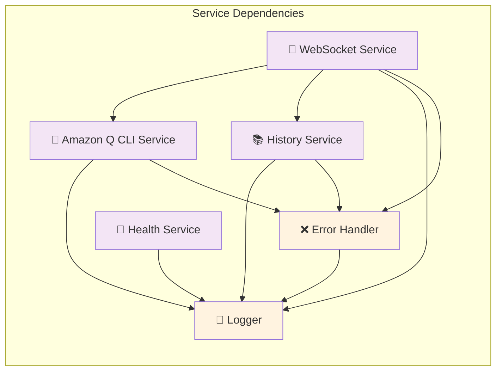
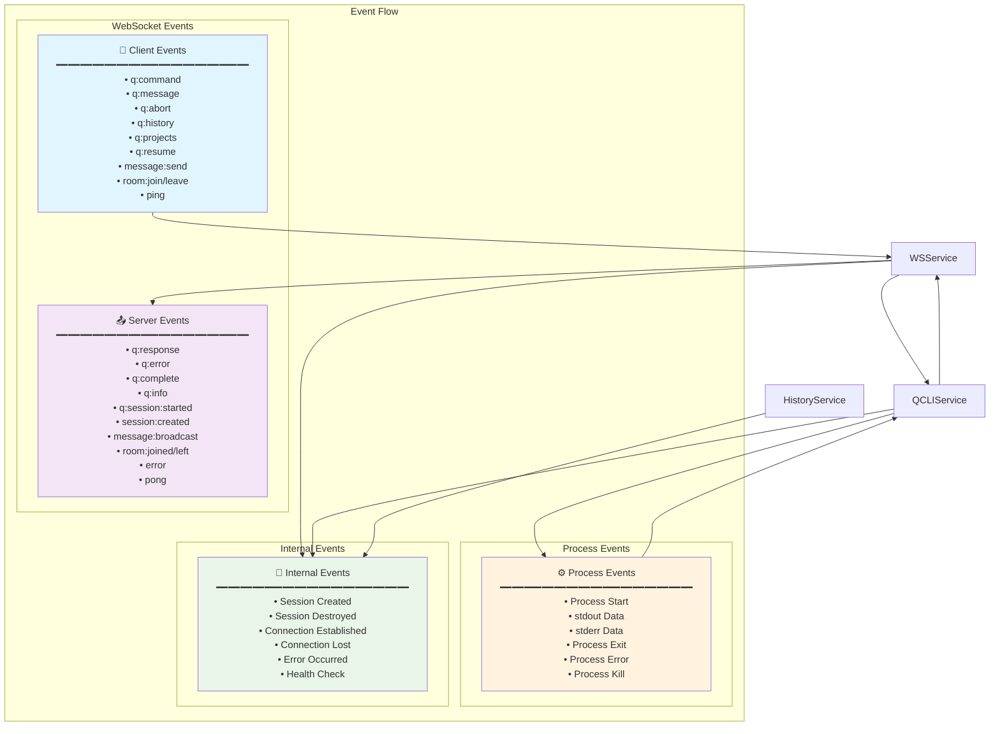
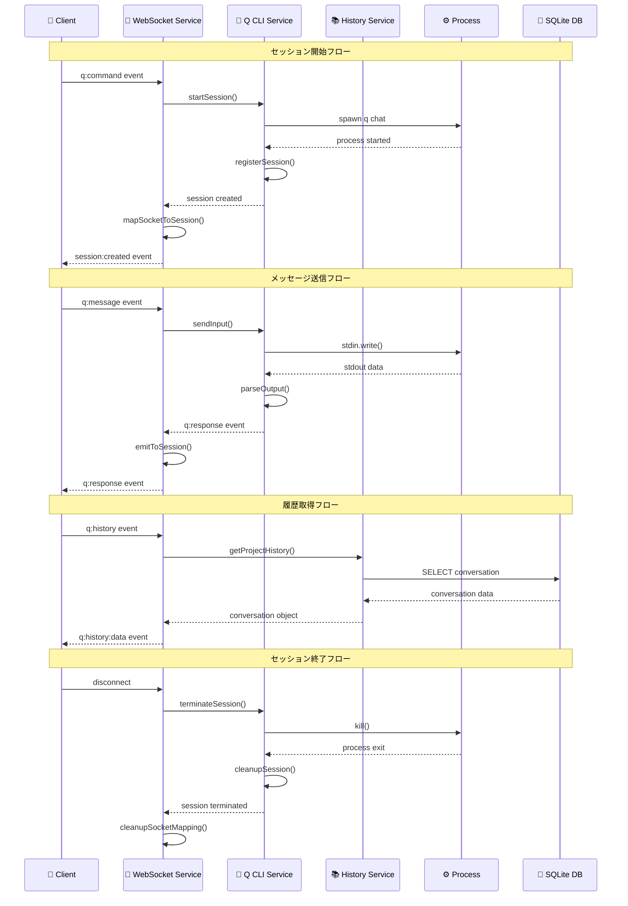
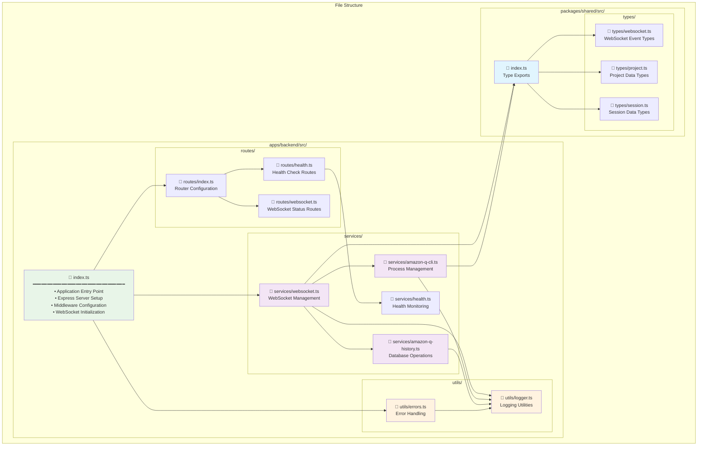

# バックエンドコンポーネント図

## C4モデル - コンポーネント図 (Backend)

```mermaid
graph TB
    subgraph "Express.js Backend Container"
        subgraph "Presentation Layer"
            Routes[🛣️ Routes<br/>apps/backend/src/routes/<br/>━━━━━━━━━━━━━━━━━━━━━━━━━━━━━━━━<br/>• Health Check Endpoint<br/>• WebSocket Status Endpoint<br/>• Express Router Configuration]
            
            Middleware[🔧 Middleware<br/>apps/backend/src/index.ts<br/>━━━━━━━━━━━━━━━━━━━━━━━━━━━━━━━━<br/>• CORS Configuration<br/>• Helmet Security Headers<br/>• Compression Middleware<br/>• Request Logging]
        end
        
        subgraph "Business Logic Layer"
            WSService[🔌 WebSocket Service<br/>apps/backend/src/services/websocket.ts<br/>━━━━━━━━━━━━━━━━━━━━━━━━━━━━━━━━<br/>• Socket.io Server Management<br/>• Event Handler Registration<br/>• Session-Socket Mapping<br/>• Room Management<br/>• Real-time Communication]
            
            QCLIService[🤖 Amazon Q CLI Service<br/>apps/backend/src/services/amazon-q-cli.ts<br/>━━━━━━━━━━━━━━━━━━━━━━━━━━━━━━━━<br/>• Child Process Management<br/>• Session State Management<br/>• stdout/stderr Streaming<br/>• Command Validation<br/>• Process Lifecycle Management]
            
            HistoryService[📚 History Service<br/>apps/backend/src/services/amazon-q-history.ts<br/>━━━━━━━━━━━━━━━━━━━━━━━━━━━━━━━━<br/>• SQLite Database Access<br/>• Conversation History Retrieval<br/>• Project Metadata Management<br/>• Database Connection Management]
            
            HealthService[🏥 Health Service<br/>apps/backend/src/services/health.ts<br/>━━━━━━━━━━━━━━━━━━━━━━━━━━━━━━━━<br/>• Server Health Monitoring<br/>• Uptime Tracking<br/>• System Status Reporting]
        end
        
        subgraph "Infrastructure Layer"
            Logger[📝 Logger<br/>apps/backend/src/utils/logger.ts<br/>━━━━━━━━━━━━━━━━━━━━━━━━━━━━━━━━<br/>• Structured Logging<br/>• Request Middleware<br/>• Error Logging<br/>• Performance Logging]
            
            ErrorHandler[❌ Error Handler<br/>apps/backend/src/utils/errors.ts<br/>━━━━━━━━━━━━━━━━━━━━━━━━━━━━━━━━<br/>• Global Error Handling<br/>• Error Response Formatting<br/>• 404 Not Found Handler<br/>• Error Logging Integration]
        end
    end
    
    subgraph "External Dependencies"
        SocketIOLib[🔌 Socket.io Library<br/>Real-time Communication]
        ExpressLib[🚀 Express.js Library<br/>HTTP Server Framework]
        SQLiteLib[💾 SQLite3 Library<br/>Database Operations]
        ChildProcess[⚙️ Child Process API<br/>Node.js Process Management]
        SharedTypes[📦 @quincy/shared<br/>Type Definitions]
    end
    
    subgraph "External Systems"
        QCli[🤖 Amazon Q CLI<br/>Child Process]
        SQLiteDB[💾 SQLite Database<br/>Session Storage]
        Frontend[📱 Angular Frontend<br/>WebSocket Client]
    end
    
    %% Presentation Layer Connections
    Routes --> HealthService
    Routes --> WSService
    Middleware --> Routes
    Middleware --> ErrorHandler
    
    %% Business Logic Layer Connections
    WSService --> QCLIService
    WSService --> HistoryService
    QCLIService --> HistoryService
    
    %% Infrastructure Layer Connections
    Logger --> WSService
    Logger --> QCLIService
    Logger --> HistoryService
    ErrorHandler --> Logger
    
    %% External Library Connections
    WSService --> SocketIOLib
    Routes --> ExpressLib
    Middleware --> ExpressLib
    QCLIService --> ChildProcess
    HistoryService --> SQLiteLib
    WSService --> SharedTypes
    QCLIService --> SharedTypes
    
    %% External System Connections
    QCLIService --> QCli
    HistoryService --> SQLiteDB
    WSService --> Frontend
    
    style Routes fill:#e8f5e8
    style Middleware fill:#e8f5e8
    style WSService fill:#f3e5f5
    style QCLIService fill:#f3e5f5
    style HistoryService fill:#f3e5f5
    style HealthService fill:#f3e5f5
    style Logger fill:#fff3e0
    style ErrorHandler fill:#fff3e0
    style QCli fill:#ffeb3b
    style SQLiteDB fill:#e3f2fd
    style Frontend fill:#e1f5fe
```

## サービス間の依存関係

```mermaid
graph LR
    subgraph "Service Dependencies"
        WSService[🔌 WebSocket Service]
        QCLIService[🤖 Amazon Q CLI Service]
        HistoryService[📚 History Service]
        HealthService[🏥 Health Service]
        Logger[📝 Logger]
        ErrorHandler[❌ Error Handler]
        
        WSService --> QCLIService
        WSService --> HistoryService
        WSService --> Logger
        WSService --> ErrorHandler
        
        QCLIService --> Logger
        QCLIService --> ErrorHandler
        
        HistoryService --> Logger
        HistoryService --> ErrorHandler
        
        HealthService --> Logger
        
        ErrorHandler --> Logger
    end
    
    style WSService fill:#f3e5f5
    style QCLIService fill:#f3e5f5
    style HistoryService fill:#f3e5f5
    style HealthService fill:#f3e5f5
    style Logger fill:#fff3e0
    style ErrorHandler fill:#fff3e0
```

## イベント駆動アーキテクチャ

```mermaid
graph TB
    subgraph "Event Flow"
        subgraph "WebSocket Events"
            ClientEvents[📨 Client Events<br/>━━━━━━━━━━━━━━━━━━━━━━━━━━━━━━━━<br/>• q:command<br/>• q:message<br/>• q:abort<br/>• q:history<br/>• q:projects<br/>• q:resume<br/>• message:send<br/>• room:join/leave<br/>• ping]
            
            ServerEvents[📤 Server Events<br/>━━━━━━━━━━━━━━━━━━━━━━━━━━━━━━━━<br/>• q:response<br/>• q:error<br/>• q:complete<br/>• q:info<br/>• q:session:started<br/>• session:created<br/>• message:broadcast<br/>• room:joined/left<br/>• error<br/>• pong]
        end
        
        subgraph "Process Events"
            ProcessEvents[⚙️ Process Events<br/>━━━━━━━━━━━━━━━━━━━━━━━━━━━━━━━━<br/>• Process Start<br/>• stdout Data<br/>• stderr Data<br/>• Process Exit<br/>• Process Error<br/>• Process Kill]
        end
        
        subgraph "Internal Events"
            InternalEvents[🔄 Internal Events<br/>━━━━━━━━━━━━━━━━━━━━━━━━━━━━━━━━<br/>• Session Created<br/>• Session Destroyed<br/>• Connection Established<br/>• Connection Lost<br/>• Error Occurred<br/>• Health Check]
        end
    end
    
    ClientEvents --> WSService
    WSService --> QCLIService
    QCLIService --> ProcessEvents
    ProcessEvents --> QCLIService
    QCLIService --> WSService
    WSService --> ServerEvents
    
    WSService --> InternalEvents
    QCLIService --> InternalEvents
    HistoryService --> InternalEvents
    
    style ClientEvents fill:#e1f5fe
    style ServerEvents fill:#f3e5f5
    style ProcessEvents fill:#fff3e0
    style InternalEvents fill:#e8f5e8
```

## データフロー詳細

```mermaid
sequenceDiagram
    participant C as 📱 Client
    participant WS as 🔌 WebSocket Service
    participant Q as 🤖 Q CLI Service
    participant H as 📚 History Service
    participant P as ⚙️ Process
    participant DB as 💾 SQLite DB
    
    Note over C,DB: セッション開始フロー
    C->>WS: q:command event
    WS->>Q: startSession()
    Q->>P: spawn q chat
    P-->>Q: process started
    Q->>Q: registerSession()
    Q-->>WS: session created
    WS->>WS: mapSocketToSession()
    WS-->>C: session:created event
    
    Note over C,DB: メッセージ送信フロー
    C->>WS: q:message event
    WS->>Q: sendInput()
    Q->>P: stdin.write()
    P-->>Q: stdout data
    Q->>Q: parseOutput()
    Q-->>WS: q:response event
    WS->>WS: emitToSession()
    WS-->>C: q:response event
    
    Note over C,DB: 履歴取得フロー
    C->>WS: q:history event
    WS->>H: getProjectHistory()
    H->>DB: SELECT conversation
    DB-->>H: conversation data
    H-->>WS: conversation object
    WS-->>C: q:history:data event
    
    Note over C,DB: セッション終了フロー
    C->>WS: disconnect
    WS->>Q: terminateSession()
    Q->>P: kill()
    P-->>Q: process exit
    Q->>Q: cleanupSession()
    Q-->>WS: session terminated
    WS->>WS: cleanupSocketMapping()
```

## モジュール構造

```mermaid
graph TB
    subgraph "File Structure"
        subgraph "apps/backend/src/"
            IndexTS[📄 index.ts<br/>━━━━━━━━━━━━━━━━━━━━━━━━━━━━━━━━<br/>• Application Entry Point<br/>• Express Server Setup<br/>• Middleware Configuration<br/>• WebSocket Initialization]
            
            subgraph "routes/"
                RouteIndex[📄 routes/index.ts<br/>Router Configuration]
                HealthRoute[📄 routes/health.ts<br/>Health Check Routes]
                WSRoute[📄 routes/websocket.ts<br/>WebSocket Status Routes]
            end
            
            subgraph "services/"
                WSServiceFile[📄 services/websocket.ts<br/>WebSocket Management]
                QCLIServiceFile[📄 services/amazon-q-cli.ts<br/>Process Management]
                HistoryServiceFile[📄 services/amazon-q-history.ts<br/>Database Operations]
                HealthServiceFile[📄 services/health.ts<br/>Health Monitoring]
            end
            
            subgraph "utils/"
                LoggerFile[📄 utils/logger.ts<br/>Logging Utilities]
                ErrorFile[📄 utils/errors.ts<br/>Error Handling]
            end
        end
        
        subgraph "packages/shared/src/"
            SharedIndex[📄 index.ts<br/>Type Exports]
            
            subgraph "types/"
                WSTypes[📄 types/websocket.ts<br/>WebSocket Event Types]
                ProjectTypes[📄 types/project.ts<br/>Project Data Types]
                SessionTypes[📄 types/session.ts<br/>Session Data Types]
            end
        end
    end
    
    IndexTS --> RouteIndex
    RouteIndex --> HealthRoute
    RouteIndex --> WSRoute
    
    IndexTS --> WSServiceFile
    WSServiceFile --> QCLIServiceFile
    WSServiceFile --> HistoryServiceFile
    HealthRoute --> HealthServiceFile
    
    WSServiceFile --> LoggerFile
    QCLIServiceFile --> LoggerFile
    HistoryServiceFile --> LoggerFile
    
    IndexTS --> ErrorFile
    ErrorFile --> LoggerFile
    
    WSServiceFile --> SharedIndex
    QCLIServiceFile --> SharedIndex
    SharedIndex --> WSTypes
    SharedIndex --> ProjectTypes
    SharedIndex --> SessionTypes
    
    style IndexTS fill:#e8f5e8
    style WSServiceFile fill:#f3e5f5
    style QCLIServiceFile fill:#f3e5f5
    style HistoryServiceFile fill:#f3e5f5
    style LoggerFile fill:#fff3e0
    style ErrorFile fill:#fff3e0
    style SharedIndex fill:#e1f5fe
```