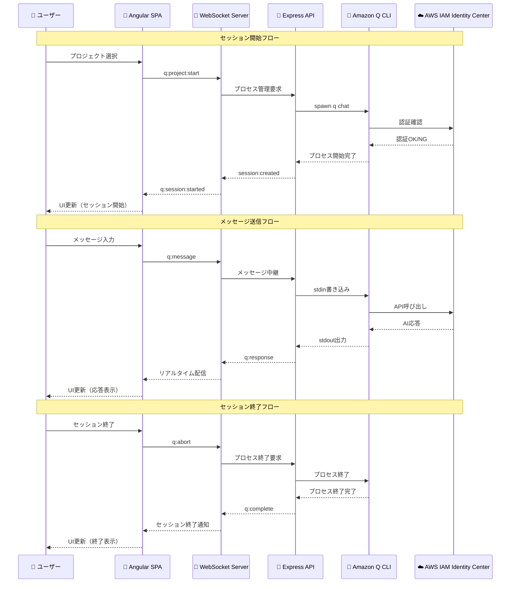

# コンテナ図

## C4モデル - コンテナ図

```mermaid
graph TB
    subgraph "User"
        User[👤 ユーザー<br/>開発者]
        Browser[🌐 Web Browser<br/>Chrome, Firefox, Safari]
    end
    
    subgraph "Quincy System"
        subgraph "Frontend Container"
            Angular[📱 Angular 20 SPA<br/>Port 4200<br/>━━━━━━━━━━━━━━━━━━━━━━━━━━━━━━━━<br/>• Standalone Components<br/>• PrimeNG UI Components<br/>• Tailwind CSS Styling<br/>• @ngrx/signals State Management<br/>• Socket.io Client<br/>• TypeScript]
        end
        
        subgraph "Backend Container"
            Express[🚀 Express.js API<br/>Port 3000<br/>━━━━━━━━━━━━━━━━━━━━━━━━━━━━━━━━<br/>• RESTful API Endpoints<br/>• Socket.io WebSocket Server<br/>• CORS, Helmet Security<br/>• Request Logging<br/>• TypeScript + Node.js]
        end
        
        subgraph "Shared Types"
            SharedTypes[📦 @quincy/shared<br/>━━━━━━━━━━━━━━━━━━━━━━━━━━━━━━━━<br/>• WebSocket Event Types<br/>• API Response Types<br/>• Business Logic Types<br/>• TypeScript Definitions]
        end
        
        subgraph "Data Storage"
            SQLite[💾 SQLite Database<br/>━━━━━━━━━━━━━━━━━━━━━━━━━━━━━━━━<br/>• Session Persistence<br/>• Amazon Q CLI History<br/>• Conversation Metadata<br/>• Local File Storage]
        end
    end
    
    subgraph "External Systems"
        QCli[🤖 Amazon Q CLI<br/>━━━━━━━━━━━━━━━━━━━━━━━━━━━━━━━━<br/>• Child Process<br/>• Command Line Interface<br/>• AWS SDK Integration<br/>• AI Assistant Engine]
        
        AWS[☁️ AWS IAM Identity Center<br/>━━━━━━━━━━━━━━━━━━━━━━━━━━━━━━━━<br/>• Authentication Service<br/>• Authorization Service<br/>• Token Management<br/>• Identity Provider]
    end
    
    User -->|"HTTP/HTTPS<br/>WebSocket"| Browser
    Browser -->|"HTTP/HTTPS<br/>WebSocket"| Angular
    Angular -->|"Socket.io<br/>WebSocket Events"| Express
    Angular -.->|"Type Imports"| SharedTypes
    Express -.->|"Type Imports"| SharedTypes
    Express -->|"Child Process<br/>spawn/exec"| QCli
    Express -->|"SQLite Queries<br/>Read/Write"| SQLite
    QCli -->|"HTTP/HTTPS<br/>AWS SDK"| AWS
    AWS -->|"Auth Tokens<br/>Permissions"| QCli
    QCli -->|"stdout/stderr<br/>Process Output"| Express
    Express -->|"WebSocket Events<br/>Real-time Data"| Angular
    Angular -->|"UI Updates<br/>DOM Rendering"| Browser
    Browser -->|"User Input<br/>Click/Type"| User
    
    style User fill:#e1f5fe
    style Browser fill:#e1f5fe
    style Angular fill:#f3e5f5
    style Express fill:#e8f5e8
    style SharedTypes fill:#fff3e0
    style SQLite fill:#e3f2fd
    style QCli fill:#fff3e0
    style AWS fill:#ffeb3b
```

## データフロー - リアルタイム通信



## コンテナ間通信パターン

```mermaid
graph LR
    subgraph "Communication Patterns"
        subgraph "HTTP/REST"
            A1[Angular] -->|HTTP GET| E1[Express]
            E1 -->|JSON Response| A1
        end
        
        subgraph "WebSocket/Real-time"
            A2[Angular] <-->|Socket.io Events| WS[WebSocket Server]
            WS <-->|Event Handlers| E2[Express]
        end
        
        subgraph "Process Communication"
            E3[Express] -->|spawn/exec| Q[Amazon Q CLI]
            Q -->|stdout/stderr| E3
            E3 -->|stdin| Q
        end
        
        subgraph "External API"
            Q2[Amazon Q CLI] <-->|AWS SDK| AWS[AWS Services]
        end
        
        subgraph "Data Storage"
            E4[Express] <-->|SQLite Queries| DB[SQLite DB]
        end
    end
    
    style A1 fill:#f3e5f5
    style A2 fill:#f3e5f5
    style E1 fill:#e8f5e8
    style E2 fill:#e8f5e8
    style E3 fill:#e8f5e8
    style E4 fill:#e8f5e8
    style WS fill:#e3f2fd
    style Q fill:#fff3e0
    style Q2 fill:#fff3e0
    style AWS fill:#ffeb3b
    style DB fill:#e3f2fd
```



## 技術スタック詳細

```mermaid
graph TB
    subgraph "Frontend Stack"
        Angular[Angular 20.0.0]
        PrimeNG[PrimeNG 20.0.0-rc.3]
        TailwindCSS[Tailwind CSS 4.1.11]
        NgRxSignals[@ngrx/signals]
        SocketClient[Socket.io-client 4.7.5]
        TypeScript1[TypeScript 5.8.3]
        
        Angular --> PrimeNG
        Angular --> TailwindCSS
        Angular --> NgRxSignals
        Angular --> SocketClient
        Angular --> TypeScript1
    end
    
    subgraph "Backend Stack"
        Express[Express.js 5.1.0]
        SocketIO[Socket.io 4.7.5]
        NodeJS[Node.js 20]
        TypeScript2[TypeScript 5.8.3]
        SQLite[SQLite3 12.2.0]
        TSX[tsx 4.7.1]
        Jest[Jest 29.5.0]
        
        Express --> SocketIO
        Express --> NodeJS
        Express --> TypeScript2
        Express --> SQLite
        Express --> TSX
        Express --> Jest
    end
    
    subgraph "Shared Stack"
        SharedTypes[@quincy/shared]
        Workspace[pnpm workspace]
        
        SharedTypes --> Workspace
    end
    
    subgraph "Security Stack"
        Helmet[Helmet 8.1.0]
        CORS[CORS 2.8.5]
        Compression[Compression 1.8.0]
        
        Express --> Helmet
        Express --> CORS
        Express --> Compression
    end
    
    subgraph "External Tools"
        QCli[Amazon Q CLI]
        AWS[AWS SDK]
        
        QCli --> AWS
    end
    
    style Angular fill:#f3e5f5
    style Express fill:#e8f5e8
    style SharedTypes fill:#fff3e0
    style QCli fill:#fff3e0
    style AWS fill:#ffeb3b
```