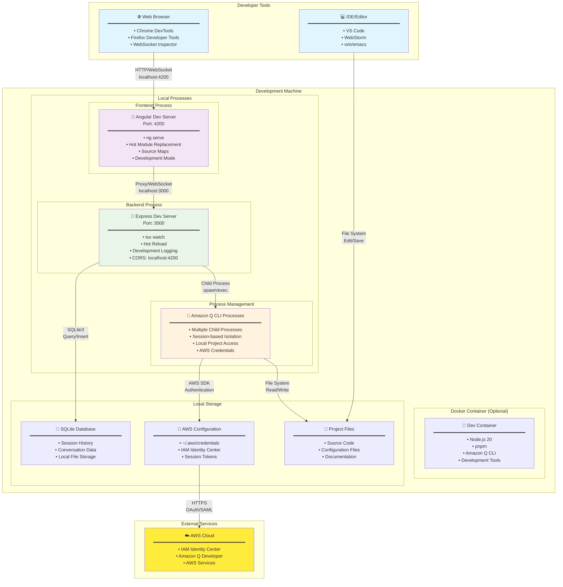
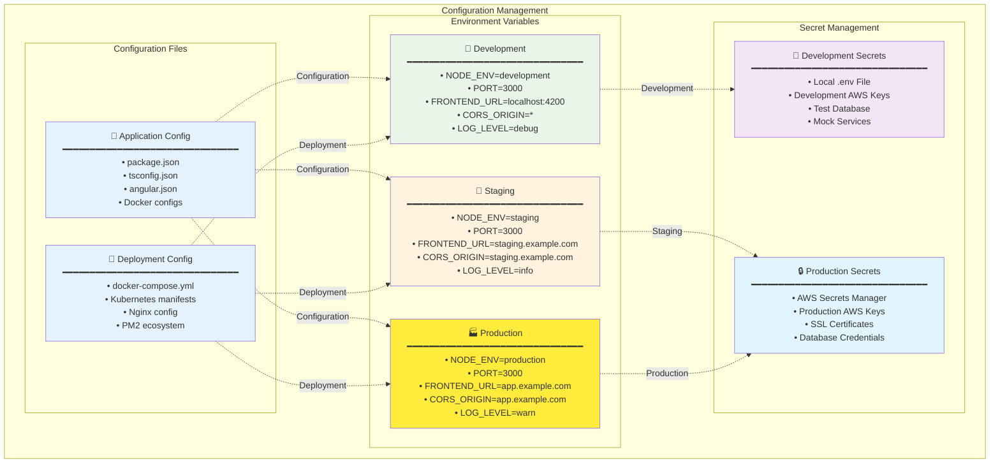

# デプロイメント図

## 開発環境デプロイメント



## 本番環境デプロイメント

```mermaid
graph TB
    subgraph "Production Infrastructure"
        subgraph "Load Balancer"
            LB[🔄 Load Balancer<br/>━━━━━━━━━━━━━━━━━━━━━━━━━━━━━━━━<br/>• HTTPS Termination<br/>• SSL Certificate<br/>• Request Routing<br/>• Health Checks]
        end

        subgraph "Application Server"
            subgraph "Web Server"
                Nginx[🌐 Nginx<br/>━━━━━━━━━━━━━━━━━━━━━━━━━━━━━━━━<br/>• Static File Serving<br/>• Reverse Proxy<br/>• Gzip Compression<br/>• Security Headers]
            end

            subgraph "Application Layer"
                ExpressProd[🚀 Express.js Server<br/>Port: 3000<br/>━━━━━━━━━━━━━━━━━━━━━━━━━━━━━━━━<br/>• Production Mode<br/>• PM2 Process Manager<br/>• Cluster Mode<br/>• Health Monitoring]

                AngularProd[📱 Angular Build<br/>Static Files<br/>━━━━━━━━━━━━━━━━━━━━━━━━━━━━━━━━<br/>• Production Build<br/>• AOT Compilation<br/>• Bundle Optimization<br/>• Service Worker]
            end

            subgraph "Process Management"
                PM2[⚙️ PM2 Process Manager<br/>━━━━━━━━━━━━━━━━━━━━━━━━━━━━━━━━<br/>• Process Clustering<br/>• Auto Restart<br/>• Log Management<br/>• Resource Monitoring]

                QCLIProd[🤖 Amazon Q CLI Processes<br/>━━━━━━━━━━━━━━━━━━━━━━━━━━━━━━━━<br/>• Isolated Processes<br/>• Resource Limits<br/>• Session Management<br/>• Security Controls]
            end
        end

        subgraph "Data Layer"
            SQLiteProd[💾 SQLite Database<br/>━━━━━━━━━━━━━━━━━━━━━━━━━━━━━━━━<br/>• Persistent Storage<br/>• Backup Strategy<br/>• File Permissions<br/>• WAL Mode]

            Logs[📝 Log Files<br/>━━━━━━━━━━━━━━━━━━━━━━━━━━━━━━━━<br/>• Application Logs<br/>• Access Logs<br/>• Error Logs<br/>• Log Rotation]
        end

        subgraph "Security Layer"
            Firewall[🔒 Firewall<br/>━━━━━━━━━━━━━━━━━━━━━━━━━━━━━━━━<br/>• Port Restrictions<br/>• IP Filtering<br/>• DDoS Protection<br/>• Intrusion Detection]

            SSL[🛡️ SSL/TLS<br/>━━━━━━━━━━━━━━━━━━━━━━━━━━━━━━━━<br/>• HTTPS Enforcement<br/>• Certificate Management<br/>• Strong Cipher Suites<br/>• HSTS Headers]
        end
    end

    subgraph "External Services"
        AWSProd[☁️ AWS Production<br/>━━━━━━━━━━━━━━━━━━━━━━━━━━━━━━━━<br/>• IAM Identity Center<br/>• Amazon Q Developer<br/>• CloudWatch Logs<br/>• AWS Services]

        CDN[🌍 CDN (Optional)<br/>━━━━━━━━━━━━━━━━━━━━━━━━━━━━━━━━<br/>• Static Asset Delivery<br/>• Global Edge Locations<br/>• Cache Management<br/>• Performance Optimization]
    end

    subgraph "Monitoring & Ops"
        Monitoring[📊 Monitoring<br/>━━━━━━━━━━━━━━━━━━━━━━━━━━━━━━━━<br/>• Application Metrics<br/>• Server Metrics<br/>• Log Aggregation<br/>• Alert Management]

        Backup[💾 Backup System<br/>━━━━━━━━━━━━━━━━━━━━━━━━━━━━━━━━<br/>• Database Backup<br/>• Configuration Backup<br/>• Automated Scheduling<br/>• Disaster Recovery]
    end

    subgraph "Users"
        EndUsers[👥 End Users<br/>━━━━━━━━━━━━━━━━━━━━━━━━━━━━━━━━<br/>• Web Browsers<br/>• Corporate Networks<br/>• VPN Connections<br/>• Mobile Devices]
    end

    %% Connections
    EndUsers -->|HTTPS<br/>Port 443| LB
    LB -->|HTTP<br/>Port 80| Nginx
    Nginx -->|Static Files| AngularProd
    Nginx -->|API/WebSocket<br/>Proxy| ExpressProd
    ExpressProd -->|Process Control| PM2
    PM2 -->|Spawn/Monitor| QCLIProd
    ExpressProd -->|SQLite3<br/>Connections| SQLiteProd
    ExpressProd -->|File I/O<br/>Logging| Logs
    QCLIProd -->|AWS SDK<br/>Authentication| AWSProd
    CDN -->|Static Assets| AngularProd
    Monitoring -->|Metrics Collection| ExpressProd
    Monitoring -->|Log Analysis| Logs
    Backup -->|Automated Backup| SQLiteProd
    Firewall -->|Network Security| LB
    SSL -->|Certificate| LB

    style LB fill:#e8f5e8
    style ExpressProd fill:#e8f5e8
    style AngularProd fill:#f3e5f5
    style QCLIProd fill:#fff3e0
    style AWSProd fill:#ffeb3b
    style EndUsers fill:#e1f5fe
```

## Docker コンテナ化デプロイメント

```mermaid
graph TB
    subgraph "Container Orchestration"
        subgraph "Docker Compose"
            ComposeFile[📄 docker-compose.yml<br/>━━━━━━━━━━━━━━━━━━━━━━━━━━━━━━━━<br/>• Service Definition<br/>• Network Configuration<br/>• Volume Mapping<br/>• Environment Variables]
        end

        subgraph "Containers"
            subgraph "Frontend Container"
                NgxContainer[📱 Nginx + Angular<br/>Port: 80<br/>━━━━━━━━━━━━━━━━━━━━━━━━━━━━━━━━<br/>• nginx:alpine<br/>• Static Files<br/>• Gzip Compression<br/>• Security Headers]
            end

            subgraph "Backend Container"
                NodeContainer[🚀 Node.js + Express<br/>Port: 3000<br/>━━━━━━━━━━━━━━━━━━━━━━━━━━━━━━━━<br/>• node:20-alpine<br/>• Production Build<br/>• Health Checks<br/>• Process Management]
            end

            subgraph "Database Container"
                SQLiteContainer[💾 SQLite + Volume<br/>━━━━━━━━━━━━━━━━━━━━━━━━━━━━━━━━<br/>• Data Persistence<br/>• Volume Mount<br/>• Backup Scripts<br/>• File Permissions]
            end
        end

        subgraph "Docker Networks"
            FrontendNet[🌐 Frontend Network<br/>━━━━━━━━━━━━━━━━━━━━━━━━━━━━━━━━<br/>• Public Access<br/>• Load Balancer<br/>• SSL Termination]

            BackendNet[🔒 Backend Network<br/>━━━━━━━━━━━━━━━━━━━━━━━━━━━━━━━━<br/>• Internal Only<br/>• Service Communication<br/>• Database Access]
        end

        subgraph "Docker Volumes"
            DataVolume[💾 Data Volume<br/>━━━━━━━━━━━━━━━━━━━━━━━━━━━━━━━━<br/>• SQLite Database<br/>• Persistent Storage<br/>• Backup Strategy]

            LogVolume[📝 Log Volume<br/>━━━━━━━━━━━━━━━━━━━━━━━━━━━━━━━━<br/>• Application Logs<br/>• Access Logs<br/>• Log Rotation]
        end
    end

    subgraph "Host Machine"
        Docker[🐳 Docker Engine<br/>━━━━━━━━━━━━━━━━━━━━━━━━━━━━━━━━<br/>• Container Runtime<br/>• Resource Management<br/>• Network Isolation<br/>• Security Controls]

        HostOS[💻 Host Operating System<br/>━━━━━━━━━━━━━━━━━━━━━━━━━━━━━━━━<br/>• Linux/Ubuntu<br/>• Docker Runtime<br/>• System Resources<br/>• Security Hardening]
    end

    subgraph "External Dependencies"
        AWSDocker[☁️ AWS Services<br/>━━━━━━━━━━━━━━━━━━━━━━━━━━━━━━━━<br/>• IAM Identity Center<br/>• Amazon Q Developer<br/>• Container Registry<br/>• CloudWatch]

        Registry[📦 Container Registry<br/>━━━━━━━━━━━━━━━━━━━━━━━━━━━━━━━━<br/>• Docker Hub<br/>• AWS ECR<br/>• Private Registry<br/>• Image Versioning]
    end

    %% Connections
    ComposeFile -->|Container Orchestration| NgxContainer
    ComposeFile -->|Container Orchestration| NodeContainer
    ComposeFile -->|Container Orchestration| SQLiteContainer
    NgxContainer -->|Network| FrontendNet
    NodeContainer -->|Network| BackendNet
    SQLiteContainer -->|Network| BackendNet
    NodeContainer -->|Volume Mount| DataVolume
    NodeContainer -->|Volume Mount| LogVolume
    SQLiteContainer -->|Volume Mount| DataVolume
    NgxContainer -->|Docker Engine| Docker
    NodeContainer -->|Docker Engine| Docker
    SQLiteContainer -->|Docker Engine| Docker
    Docker -->|Host System| HostOS
    NodeContainer -->|Amazon Q CLI<br/>Container Access| AWSDocker
    Docker -->|Image Pull| Registry

    style NgxContainer fill:#f3e5f5
    style NodeContainer fill:#e8f5e8
    style SQLiteContainer fill:#e3f2fd
    style Docker fill:#0db7ed
    style AWSDocker fill:#ffeb3b
    style Registry fill:#fff3e0
```



## CI/CD パイプライン

```mermaid
graph LR
    subgraph "Source Control"
        GitHub[📂 GitHub Repository<br/>━━━━━━━━━━━━━━━━━━━━━━━━━━━━━━━━<br/>• Source Code<br/>• Branch Management<br/>• Pull Requests<br/>• Release Tags]
    end

    subgraph "CI/CD Pipeline"
        subgraph "Build Stage"
            GHActions[🔧 GitHub Actions<br/>━━━━━━━━━━━━━━━━━━━━━━━━━━━━━━━━<br/>• Automated Testing<br/>• Type Checking<br/>• Linting<br/>• Security Scanning]

            BuildSteps[🏗️ Build Steps<br/>━━━━━━━━━━━━━━━━━━━━━━━━━━━━━━━━<br/>• pnpm install<br/>• pnpm build<br/>• pnpm test<br/>• pnpm typecheck]
        end

        subgraph "Package Stage"
            DockerBuild[🐳 Docker Build<br/>━━━━━━━━━━━━━━━━━━━━━━━━━━━━━━━━<br/>• Multi-stage Build<br/>• Layer Optimization<br/>• Security Scanning<br/>• Vulnerability Check]

            Registry2[📦 Container Registry<br/>━━━━━━━━━━━━━━━━━━━━━━━━━━━━━━━━<br/>• Image Storage<br/>• Version Tagging<br/>• Artifact Management<br/>• Distribution]
        end

        subgraph "Deploy Stage"
            Deploy[🚀 Deployment<br/>━━━━━━━━━━━━━━━━━━━━━━━━━━━━━━━━<br/>• Container Deployment<br/>• Health Checks<br/>• Rollback Strategy<br/>• Monitoring Setup]
        end
    end

    subgraph "Target Environments"
        Staging[🧪 Staging Environment<br/>━━━━━━━━━━━━━━━━━━━━━━━━━━━━━━━━<br/>• Integration Testing<br/>• User Acceptance Testing<br/>• Performance Testing<br/>• Security Testing]

        Production[🏭 Production Environment<br/>━━━━━━━━━━━━━━━━━━━━━━━━━━━━━━━━<br/>• Live System<br/>• Load Balancing<br/>• Monitoring<br/>• Backup Systems]
    end

    subgraph "Quality Gates"
        Tests[🧪 Quality Checks<br/>━━━━━━━━━━━━━━━━━━━━━━━━━━━━━━━━<br/>• Unit Tests<br/>• Integration Tests<br/>• E2E Tests<br/>• Security Tests]

        Approval[✅ Manual Approval<br/>━━━━━━━━━━━━━━━━━━━━━━━━━━━━━━━━<br/>• Code Review<br/>• Deployment Approval<br/>• Release Notes<br/>• Rollback Plan]
    end

    %% Connections
    GitHub -->|Trigger| GHActions
    GHActions -->|Build| BuildSteps
    BuildSteps -->|Package| DockerBuild
    DockerBuild -->|Push| Registry2
    Registry2 -->|Deploy| Deploy
    Deploy -->|First| Staging
    Staging -->|Quality Gate| Tests
    Tests -->|Manual Review| Approval
    Approval -->|Promote| Production
    BuildSteps -->|Quality Gate| Tests

    style GitHub fill:#e1f5fe
    style GHActions fill:#e8f5e8
    style DockerBuild fill:#0db7ed
    style Staging fill:#fff3e0
    style Production fill:#ffeb3b
    style Tests fill:#f3e5f5
    style Approval fill:#e8f5e8
```



## 環境設定管理


