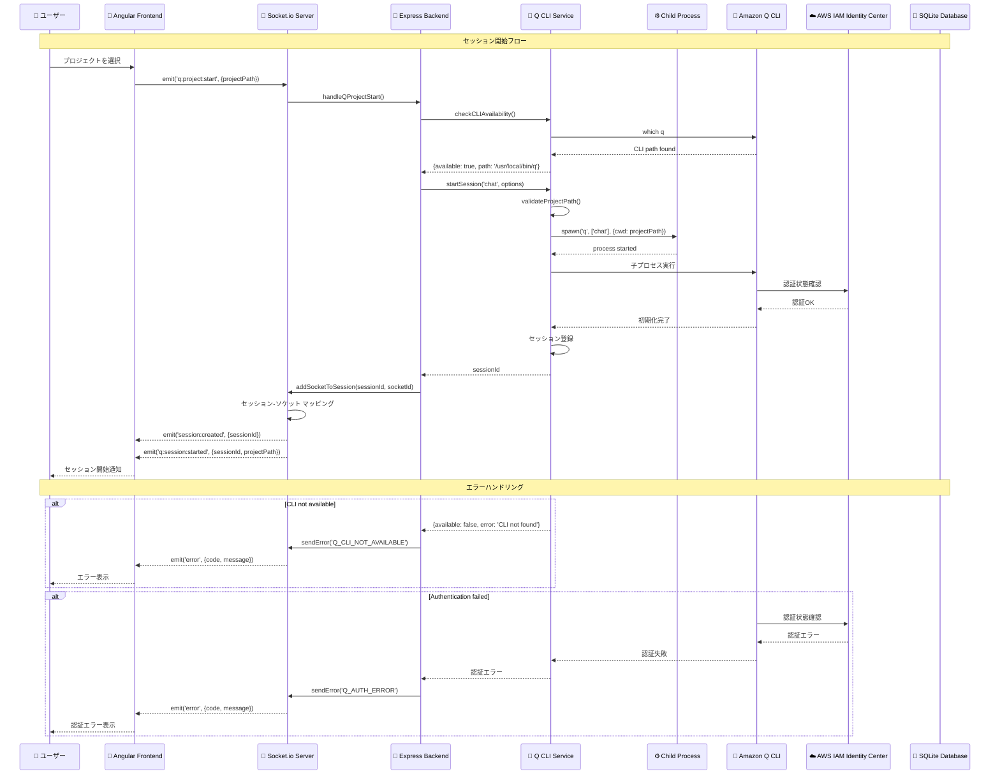
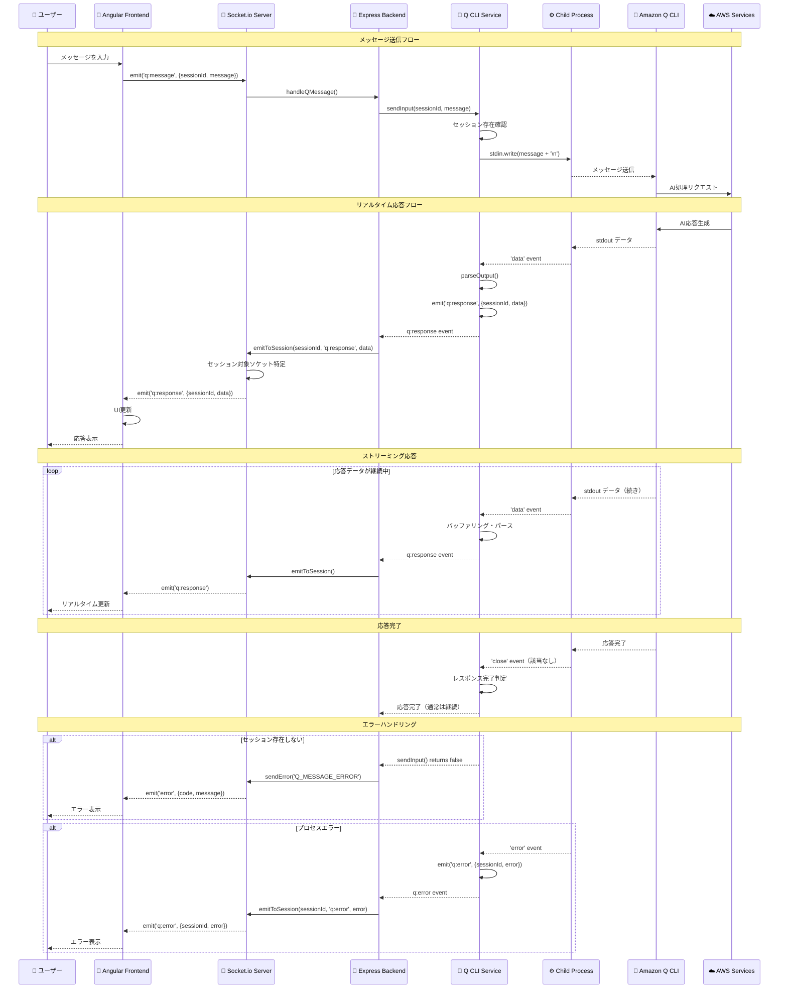
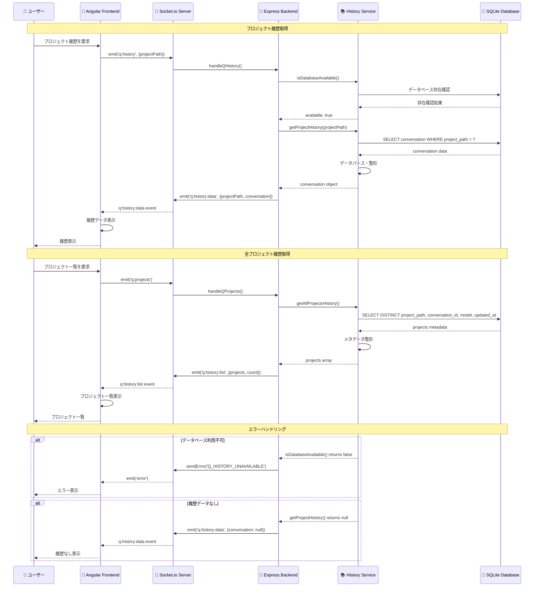
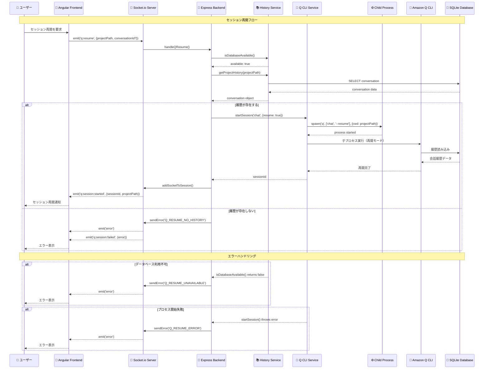
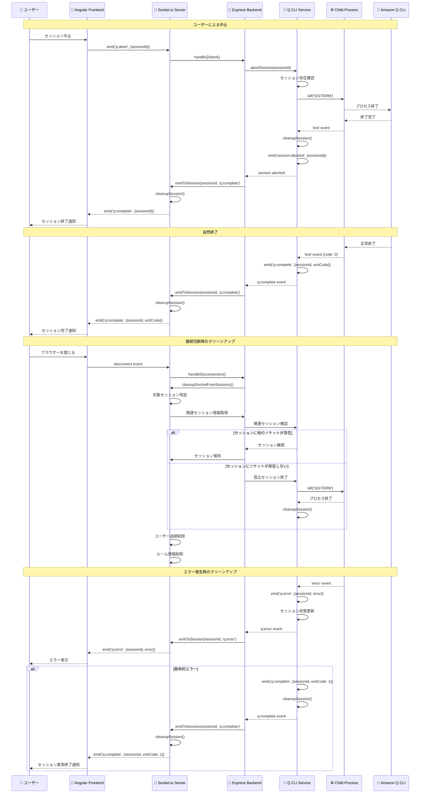

# シーケンス図

## ユーザー操作フロー - 新規セッション開始

```mermaid
sequenceDiagram
    participant User as 👤 ユーザー
    participant Angular as 📱 Angular Frontend
    participant SocketIO as 🔌 Socket.io Server
    participant Express as 🚀 Express Backend
    participant QCLIService as 🤖 Q CLI Service
    participant Process as ⚙️ Child Process
    participant QCli as 🤖 Amazon Q CLI
    participant AWS as ☁️ AWS IAM Identity Center
    participant SQLite as 💾 SQLite Database
    
    Note over User,SQLite: セッション開始フロー
    User->>Angular: プロジェクトを選択
    Angular->>SocketIO: emit('q:project:start', {projectPath})
    SocketIO->>Express: handleQProjectStart()
    Express->>QCLIService: checkCLIAvailability()
    QCLIService->>QCli: which q
    QCli-->>QCLIService: CLI path found
    QCLIService-->>Express: {available: true, path: '/usr/local/bin/q'}
    
    Express->>QCLIService: startSession('chat', options)
    QCLIService->>QCLIService: validateProjectPath()
    QCLIService->>Process: spawn('q', ['chat'], {cwd: projectPath})
    Process-->>QCLIService: process started
    QCLIService->>QCli: 子プロセス実行
    QCli->>AWS: 認証状態確認
    AWS-->>QCli: 認証OK
    QCli-->>QCLIService: 初期化完了
    QCLIService->>QCLIService: セッション登録
    QCLIService-->>Express: sessionId
    
    Express->>SocketIO: addSocketToSession(sessionId, socketId)
    SocketIO->>SocketIO: セッション-ソケット マッピング
    SocketIO-->>Angular: emit('session:created', {sessionId})
    SocketIO-->>Angular: emit('q:session:started', {sessionId, projectPath})
    Angular-->>User: セッション開始通知
    
    Note over User,SQLite: エラーハンドリング
    alt CLI not available
        QCLIService-->>Express: {available: false, error: 'CLI not found'}
        Express->>SocketIO: sendError('Q_CLI_NOT_AVAILABLE')
        SocketIO-->>Angular: emit('error', {code, message})
        Angular-->>User: エラー表示
    end
    
    alt Authentication failed
        QCli->>AWS: 認証状態確認
        AWS-->>QCli: 認証エラー
        QCli-->>QCLIService: 認証失敗
        QCLIService-->>Express: 認証エラー
        Express->>SocketIO: sendError('Q_AUTH_ERROR')
        SocketIO-->>Angular: emit('error', {code, message})
        Angular-->>User: 認証エラー表示
    end
```

## メッセージ送信・受信フロー

```mermaid
sequenceDiagram
    participant User as 👤 ユーザー
    participant Angular as 📱 Angular Frontend
    participant SocketIO as 🔌 Socket.io Server
    participant Express as 🚀 Express Backend
    participant QCLIService as 🤖 Q CLI Service
    participant Process as ⚙️ Child Process
    participant QCli as 🤖 Amazon Q CLI
    participant AWS as ☁️ AWS Services
    
    Note over User,AWS: メッセージ送信フロー
    User->>Angular: メッセージを入力
    Angular->>SocketIO: emit('q:message', {sessionId, message})
    SocketIO->>Express: handleQMessage()
    Express->>QCLIService: sendInput(sessionId, message)
    QCLIService->>QCLIService: セッション存在確認
    QCLIService->>Process: stdin.write(message + '\n')
    Process-->>QCli: メッセージ送信
    QCli->>AWS: AI処理リクエスト
    
    Note over User,AWS: リアルタイム応答フロー
    AWS->>QCli: AI応答生成
    QCli-->>Process: stdout データ
    Process-->>QCLIService: 'data' event
    QCLIService->>QCLIService: parseOutput()
    QCLIService->>QCLIService: emit('q:response', {sessionId, data})
    QCLIService-->>Express: q:response event
    Express->>SocketIO: emitToSession(sessionId, 'q:response', data)
    SocketIO->>SocketIO: セッション対象ソケット特定
    SocketIO-->>Angular: emit('q:response', {sessionId, data})
    Angular->>Angular: UI更新
    Angular-->>User: 応答表示
    
    Note over User,AWS: ストリーミング応答
    loop 応答データが継続中
        QCli-->>Process: stdout データ（続き）
        Process-->>QCLIService: 'data' event
        QCLIService->>QCLIService: バッファリング・パース
        QCLIService-->>Express: q:response event
        Express->>SocketIO: emitToSession()
        SocketIO-->>Angular: emit('q:response')
        Angular-->>User: リアルタイム更新
    end
    
    Note over User,AWS: 応答完了
    QCli-->>Process: 応答完了
    Process-->>QCLIService: 'close' event（該当なし）
    QCLIService->>QCLIService: レスポンス完了判定
    QCLIService-->>Express: 応答完了（通常は継続）
    
    Note over User,AWS: エラーハンドリング
    alt セッション存在しない
        QCLIService-->>Express: sendInput() returns false
        Express->>SocketIO: sendError('Q_MESSAGE_ERROR')
        SocketIO-->>Angular: emit('error', {code, message})
        Angular-->>User: エラー表示
    end
    
    alt プロセスエラー
        Process-->>QCLIService: 'error' event
        QCLIService->>QCLIService: emit('q:error', {sessionId, error})
        QCLIService-->>Express: q:error event
        Express->>SocketIO: emitToSession(sessionId, 'q:error', error)
        SocketIO-->>Angular: emit('q:error', {sessionId, error})
        Angular-->>User: エラー表示
    end
```

## 履歴取得フロー

```mermaid
sequenceDiagram
    participant User as 👤 ユーザー
    participant Angular as 📱 Angular Frontend
    participant SocketIO as 🔌 Socket.io Server
    participant Express as 🚀 Express Backend
    participant HistoryService as 📚 History Service
    participant SQLite as 💾 SQLite Database
    
    Note over User,SQLite: プロジェクト履歴取得
    User->>Angular: プロジェクト履歴を要求
    Angular->>SocketIO: emit('q:history', {projectPath})
    SocketIO->>Express: handleQHistory()
    Express->>HistoryService: isDatabaseAvailable()
    HistoryService->>SQLite: データベース存在確認
    SQLite-->>HistoryService: 存在確認結果
    HistoryService-->>Express: available: true
    
    Express->>HistoryService: getProjectHistory(projectPath)
    HistoryService->>SQLite: SELECT conversation WHERE project_path = ?
    SQLite-->>HistoryService: conversation data
    HistoryService->>HistoryService: データパース・整形
    HistoryService-->>Express: conversation object
    Express->>SocketIO: emit('q:history:data', {projectPath, conversation})
    SocketIO-->>Angular: q:history:data event
    Angular->>Angular: 履歴データ表示
    Angular-->>User: 履歴表示
    
    Note over User,SQLite: 全プロジェクト履歴取得
    User->>Angular: プロジェクト一覧を要求
    Angular->>SocketIO: emit('q:projects')
    SocketIO->>Express: handleQProjects()
    Express->>HistoryService: getAllProjectsHistory()
    HistoryService->>SQLite: SELECT DISTINCT project_path, conversation_id, model, updated_at
    SQLite-->>HistoryService: projects metadata
    HistoryService->>HistoryService: メタデータ整形
    HistoryService-->>Express: projects array
    Express->>SocketIO: emit('q:history:list', {projects, count})
    SocketIO-->>Angular: q:history:list event
    Angular->>Angular: プロジェクト一覧表示
    Angular-->>User: プロジェクト一覧
    
    Note over User,SQLite: エラーハンドリング
    alt データベース利用不可
        HistoryService-->>Express: isDatabaseAvailable() returns false
        Express->>SocketIO: sendError('Q_HISTORY_UNAVAILABLE')
        SocketIO-->>Angular: emit('error')
        Angular-->>User: エラー表示
    end
    
    alt 履歴データなし
        HistoryService-->>Express: getProjectHistory() returns null
        Express->>SocketIO: emit('q:history:data', {conversation: null})
        SocketIO-->>Angular: q:history:data event
        Angular-->>User: 履歴なし表示
    end
```

## セッション再開フロー

```mermaid
sequenceDiagram
    participant User as 👤 ユーザー
    participant Angular as 📱 Angular Frontend
    participant SocketIO as 🔌 Socket.io Server
    participant Express as 🚀 Express Backend
    participant HistoryService as 📚 History Service
    participant QCLIService as 🤖 Q CLI Service
    participant Process as ⚙️ Child Process
    participant QCli as 🤖 Amazon Q CLI
    participant SQLite as 💾 SQLite Database
    
    Note over User,SQLite: セッション再開フロー
    User->>Angular: セッション再開を要求
    Angular->>SocketIO: emit('q:resume', {projectPath, conversationId?})
    SocketIO->>Express: handleQResume()
    Express->>HistoryService: isDatabaseAvailable()
    HistoryService-->>Express: available: true
    
    Express->>HistoryService: getProjectHistory(projectPath)
    HistoryService->>SQLite: SELECT conversation
    SQLite-->>HistoryService: conversation data
    HistoryService-->>Express: conversation object
    
    alt 履歴が存在する
        Express->>QCLIService: startSession('chat', {resume: true})
        QCLIService->>Process: spawn('q', ['chat', '--resume'], {cwd: projectPath})
        Process-->>QCLIService: process started
        QCLIService->>QCli: 子プロセス実行（再開モード）
        QCli->>SQLite: 履歴読み込み
        SQLite-->>QCli: 会話履歴データ
        QCli-->>QCLIService: 再開完了
        QCLIService-->>Express: sessionId
        Express->>SocketIO: addSocketToSession()
        SocketIO-->>Angular: emit('q:session:started', {sessionId, projectPath})
        Angular-->>User: セッション再開通知
    else 履歴が存在しない
        Express->>SocketIO: sendError('Q_RESUME_NO_HISTORY')
        SocketIO-->>Angular: emit('error')
        SocketIO-->>Angular: emit('q:session:failed', {error})
        Angular-->>User: エラー表示
    end
    
    Note over User,SQLite: エラーハンドリング
    alt データベース利用不可
        HistoryService-->>Express: isDatabaseAvailable() returns false
        Express->>SocketIO: sendError('Q_RESUME_UNAVAILABLE')
        SocketIO-->>Angular: emit('error')
        Angular-->>User: エラー表示
    end
    
    alt プロセス開始失敗
        QCLIService-->>Express: startSession() throws error
        Express->>SocketIO: sendError('Q_RESUME_ERROR')
        SocketIO-->>Angular: emit('error')
        Angular-->>User: エラー表示
    end
```

## セッション終了・クリーンアップフロー

```mermaid
sequenceDiagram
    participant User as 👤 ユーザー
    participant Angular as 📱 Angular Frontend
    participant SocketIO as 🔌 Socket.io Server
    participant Express as 🚀 Express Backend
    participant QCLIService as 🤖 Q CLI Service
    participant Process as ⚙️ Child Process
    participant QCli as 🤖 Amazon Q CLI
    
    Note over User,QCli: ユーザーによる中止
    User->>Angular: セッション中止
    Angular->>SocketIO: emit('q:abort', {sessionId})
    SocketIO->>Express: handleQAbort()
    Express->>QCLIService: abortSession(sessionId)
    QCLIService->>QCLIService: セッション存在確認
    QCLIService->>Process: kill('SIGTERM')
    Process-->>QCli: プロセス終了
    QCli-->>Process: 終了完了
    Process-->>QCLIService: 'exit' event
    QCLIService->>QCLIService: cleanupSession()
    QCLIService->>QCLIService: emit('session:aborted', {sessionId})
    QCLIService-->>Express: session aborted
    Express->>SocketIO: emitToSession(sessionId, 'q:complete')
    SocketIO->>SocketIO: cleanupSession()
    SocketIO-->>Angular: emit('q:complete', {sessionId})
    Angular-->>User: セッション終了通知
    
    Note over User,QCli: 自然終了
    QCli-->>Process: 正常終了
    Process-->>QCLIService: 'exit' event (code: 0)
    QCLIService->>QCLIService: emit('q:complete', {sessionId, exitCode})
    QCLIService-->>Express: q:complete event
    Express->>SocketIO: emitToSession(sessionId, 'q:complete')
    SocketIO->>SocketIO: cleanupSession()
    SocketIO-->>Angular: emit('q:complete', {sessionId, exitCode})
    Angular-->>User: セッション完了通知
    
    Note over User,QCli: 接続切断時のクリーンアップ
    User->>Angular: ブラウザーを閉じる
    Angular->>SocketIO: disconnect event
    SocketIO->>Express: handleDisconnection()
    Express->>SocketIO: cleanupSocketFromSessions()
    SocketIO->>SocketIO: 対象セッション特定
    SocketIO->>Express: 関連セッション情報取得
    Express->>QCLIService: 関連セッション確認
    
    alt セッションに他のソケットが存在
        QCLIService-->>Express: セッション継続
        Express->>SocketIO: セッション保持
    else セッションにソケットが存在しない
        Express->>QCLIService: 孤立セッション終了
        QCLIService->>Process: kill('SIGTERM')
        Process-->>QCLIService: プロセス終了
        QCLIService->>QCLIService: cleanupSession()
    end
    
    SocketIO->>SocketIO: ユーザー追跡削除
    SocketIO->>SocketIO: ルーム情報削除
    
    Note over User,QCli: エラー発生時のクリーンアップ
    Process-->>QCLIService: 'error' event
    QCLIService->>QCLIService: emit('q:error', {sessionId, error})
    QCLIService->>QCLIService: セッション状態更新
    QCLIService-->>Express: q:error event
    Express->>SocketIO: emitToSession(sessionId, 'q:error')
    SocketIO-->>Angular: emit('q:error', {sessionId, error})
    Angular-->>User: エラー表示
    
    alt 致命的エラー
        QCLIService->>QCLIService: emit('q:complete', {sessionId, exitCode: 1})
        QCLIService->>QCLIService: cleanupSession()
        QCLIService-->>Express: q:complete event
        Express->>SocketIO: emitToSession(sessionId, 'q:complete')
        SocketIO->>SocketIO: cleanupSession()
        SocketIO-->>Angular: emit('q:complete', {sessionId, exitCode: 1})
        Angular-->>User: セッション異常終了通知
    end
```