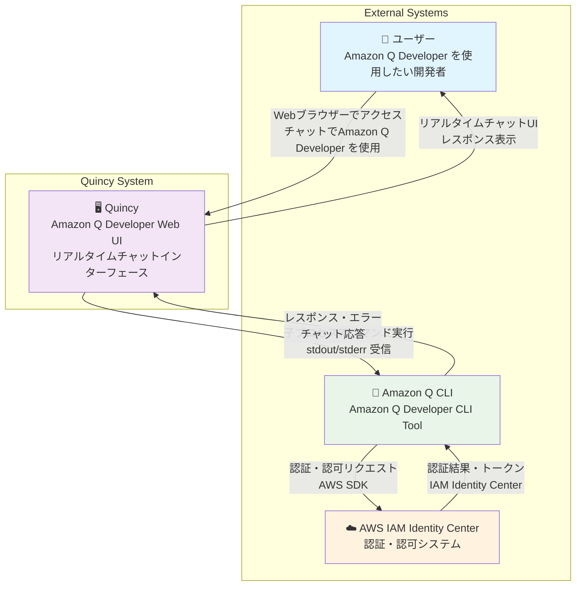
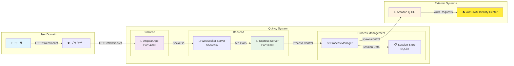
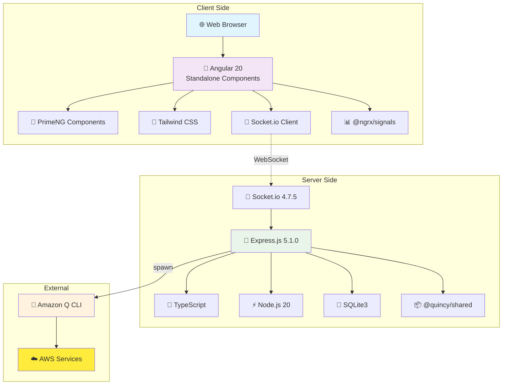

# システムコンテキスト図

## C4モデル - システムコンテキスト

```mermaid
graph TB
    subgraph "External Systems"
        User[👤 ユーザー<br/>Amazon Q Developer を使用したい開発者]
        QCli[🤖 Amazon Q CLI<br/>Amazon Q Developer CLI Tool]
        AWS[☁️ AWS IAM Identity Center<br/>認証・認可システム]
    end

    subgraph "Quincy System"
        QuincyApp[🖥️ Quincy<br/>Amazon Q Developer Web UI<br/>リアルタイムチャットインターフェース]
    end

    User -->|"Webブラウザーでアクセス<br/>チャットでAmazon Q Developer を使用"| QuincyApp
    QuincyApp -->|"子プロセスでコマンド実行<br/>stdout/stderr 受信"| QCli
    QCli -->|"認証・認可リクエスト<br/>AWS SDK"| AWS
    AWS -->|"認証結果・トークン<br/>IAM Identity Center"| QCli
    QCli -->|"レスポンス・エラー<br/>チャット応答"| QuincyApp
    QuincyApp -->|"リアルタイムチャットUI<br/>レスポンス表示"| User

    style User fill:#e1f5fe
    style QuincyApp fill:#f3e5f5
    style QCli fill:#e8f5e8
    style AWS fill:#fff3e0
```

## システム境界とデータフロー

```mermaid
graph LR
    subgraph "User Domain"
        U[👤 ユーザー]
        B[🌐 ブラウザー]
    end

    subgraph "Quincy System"
        subgraph "Frontend"
            Angular[📱 Angular App<br/>Port 4200]
        end

        subgraph "Backend"
            Express[🚀 Express Server<br/>Port 3000]
            WS[🔌 WebSocket Server<br/>Socket.io]
        end

        subgraph "Process Management"
            PM[⚙️ Process Manager]
            Sessions[📋 Session Store<br/>SQLite]
        end
    end

    subgraph "External Systems"
        QCli[🤖 Amazon Q CLI]
        AWS[☁️ AWS IAM Identity Center]
    end

    U -->|HTTP/WebSocket| B
    B -->|HTTP/WebSocket| Angular
    Angular -->|Socket.io| WS
    WS -->|API Calls| Express
    Express -->|Process Control| PM
    PM -->|spawn/control| QCli
    PM -->|Session Data| Sessions
    QCli -->|Auth Requests| AWS

    style U fill:#e1f5fe
    style Angular fill:#f3e5f5
    style Express fill:#e8f5e8
    style QCli fill:#fff3e0
    style AWS fill:#ffeb3b
```

## 技術スタック概要

```mermaid
graph TB
    subgraph "Client Side"
        Browser[🌐 Web Browser]
        Angular[📱 Angular 20<br/>Standalone Components]
        PrimeNG[🎨 PrimeNG Components]
        TailwindCSS[🎨 Tailwind CSS]
        SocketClient[🔌 Socket.io Client]
        NgRxSignals[📊 @ngrx/signals]
    end

    subgraph "Server Side"
        Express[🚀 Express.js 5.1.0]
        SocketIO[🔌 Socket.io 4.7.5]
        TypeScript[📝 TypeScript]
        NodeJS[⚡ Node.js 20]
        SQLite[💾 SQLite3]
        SharedTypes[📦 @quincy/shared]
    end

    subgraph "External"
        QCli[🤖 Amazon Q CLI]
        AWS[☁️ AWS Services]
    end

    Browser --> Angular
    Angular --> PrimeNG
    Angular --> TailwindCSS
    Angular --> SocketClient
    Angular --> NgRxSignals

    SocketClient -.->|WebSocket| SocketIO
    SocketIO --> Express
    Express --> TypeScript
    Express --> NodeJS
    Express --> SQLite
    Express --> SharedTypes

    Express -->|spawn| QCli
    QCli --> AWS

    style Browser fill:#e1f5fe
    style Angular fill:#f3e5f5
    style Express fill:#e8f5e8
    style QCli fill:#fff3e0
    style AWS fill:#ffeb3b
```
